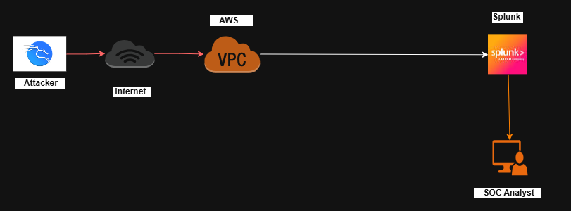

# 🖥️ Day 2 – Splunk Server Deployment on AWS

---

## 🎯 Objective

Deploy and configure **Splunk Enterprise SIEM** on an Ubuntu EC2 instance inside a custom AWS VPC to act as the central log monitoring server for the Enterprise SOC Lab.

---

## 🏗️ Architecture Overview

### 🔁 Data Flow

```
Attacker → Internet → AWS VPC → Splunk Server → SOC Analyst
```

This means:

- Logs are generated from systems
- Logs are sent to Splunk
- SOC Analyst monitors and investigates alerts

---

## 📸 Splunk Deployment Architecture

<p align="center">
  
</p>

---

# 🚀 Step 1 – Launch Ubuntu EC2 Instance

### 🔹 Go to AWS Console → EC2 → Launch Instance

Configure:

- **AMI:** Ubuntu Server 22.04 LTS
- **Instance Type:** t2.micro (Free Tier)
- **Key Pair:** Select or create new
- **Network:** Custom SOC VPC
- **Auto-assign Public IP:** Enabled

---

## 🔐 Step 2 – Configure Security Group

Allow the following inbound ports:

| Port | Protocol | Purpose |
|------|----------|----------|
| 22 | TCP | SSH Access |
| 8000 | TCP | Splunk Web Interface |
| 9997 | TCP | Log Receiving Port |

---

## 📸 EC2 Instance Running

<p align="center">
  
</p>

---

# 🔑 Step 3 – Connect to EC2 via SSH

From your local machine:

```bash
ssh -i your-key.pem ubuntu@<EC2-Public-IP>
```

Example:

```bash
ssh -i soc-key.pem ubuntu@18.226.xxx.xxx
```

---

# 🔄 Step 4 – Update System Packages

```bash
sudo apt update
sudo apt upgrade -y
```

---

# 📥 Step 5 – Download Splunk Enterprise

```bash
wget -O splunk.tgz https://download.splunk.com/products/splunk/releases/9.x.x/linux/splunk-9.x.x-linux-amd64.tgz
```

---

# 📂 Step 6 – Extract & Install Splunk

```bash
tar -xvzf splunk.tgz
sudo mv splunk /opt/
cd /opt/splunk/bin
```

---

# ▶ Step 7 – Start Splunk

```bash
sudo ./splunk start
```

- Accept license → type `y`
- Create admin username
- Create password

---

## 📸 Splunk Installation Output

<p align="center">
  
</p>

---

# 🌐 Step 8 – Access Splunk Web Interface

Open browser:

```
http://<EC2-Public-IP>:8000
```

Example:

```
http://18.226.xxx.xxx:8000
```

Login using admin credentials.

---

## 📸 Splunk Web Login Page


<p align="center">
  
</p>


---

# 📡 Step 9 – Enable Log Receiving (Port 9997)

Inside Splunk:

1. Go to **Settings**
2. Click **Forwarding and Receiving**
3. Select **Configure Receiving**
4. Add new port
5. Enter:

```
9997
```

Save changes.

---

# 🔄 Step 10 – Enable Auto Start on Boot

```bash
sudo ./splunk enable boot-start
```

---

# ✅ Step 11 – Verify Splunk Status

```bash
sudo ./splunk status
```

Expected Output:

```
splunkd is running
```

---

# 🏆 Day 2 Achievements

✔ Ubuntu EC2 deployed  
✔ Custom Security Group configured  
✔ Splunk Enterprise installed  
✔ Web Interface accessible  
✔ Log receiving port enabled  
✔ Boot start configured  

---

# 🧠 Skills Demonstrated

- AWS EC2 Deployment
- Linux Administration
- Security Group Configuration
- Splunk Installation
- SIEM Infrastructure Setup
- SOC Architecture Building

---

# 🚀 Next Steps

- Create Splunk Indexes
- Install Universal Forwarder on Windows
- Connect Active Directory logs to Splunk
- Build Detection Rules
